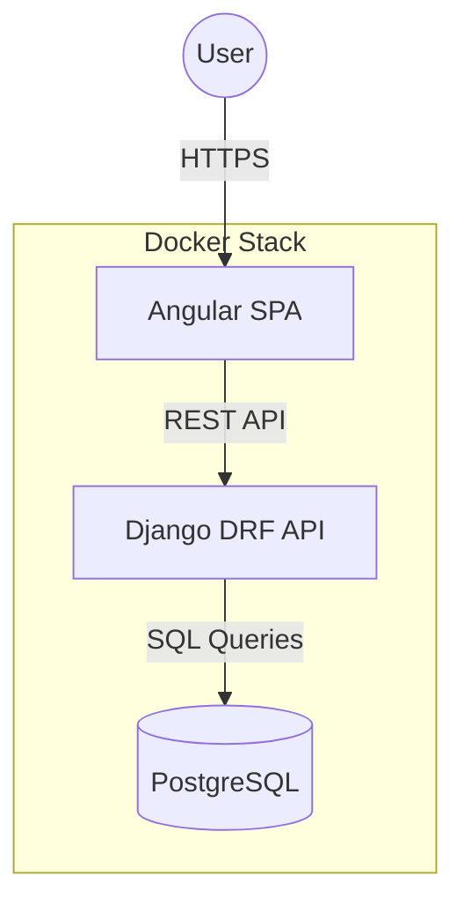

# Human Resource Management System (HRMS)

[](https://opensource.org/licenses/MIT)
[](https://docs.djangoproject.com/en/6.0/)
[](https://www.docker.com/)

A streamlined, full-stack Human Resource Management System designed for efficient employee data tracking and attendance management. This project focuses on core functionality, providing a clean architecture for organizational personnel oversight.

## 🚀 Core Features

- **📊 Management Dashboard:** Real-time visualization of organizational metrics and personnel overview.
- **👥 Employee Directory:** Comprehensive management of employee profiles, including ID, full name, email, and department details.
- **📅 Attendance Tracking:** Automated and manual attendance logging with date-specific status (Present/Absent).
- **📖 Interactive API Docs:** Comprehensive OpenAPI 3.0 documentation via Swagger UI and Redoc.

---

## 🏗 System Architecture

The project follows a standard 3-tier architecture, containerized with Docker for seamless orchestration:



---

## 🛠 Tech Stack

| Layer | Technology | Infrastructure |
| :--- | :----------- | :------------- |
| **Frontend** | Angular 15+, Angular Material | Nginx (Docker) |
| **Backend** | Django 6.0, REST Framework | Gunicorn |
| **Database** | PostgreSQL 15 | Persistent Volume |
| **Documentation** | drf-spectacular (Swagger) | OpenAPI 3.0 |

---

## 🚦 Getting Started

### Prerequisites
- **Docker** and **Docker Compose** installed on your machine.

### Quick Start (Recommended)
Launch the entire stack with a single command:
```bash
docker-compose up --build
```

### Access Points
- **Web App:** `http://localhost:80`
- **Backend API:** `http://localhost:8000/api/`
- **Swagger Docs:** `http://localhost:8000/api/docs/`
- **Redoc UI:** `http://localhost:8000/api/redoc/`

---

## 📂 Project Structure

```text
hrms/
├── backend/            # Django API Service
│   ├── attendance/     # Attendance Logic & Models
│   ├── employees/      # Employee Records Logic
│   └── hrms_backend/   # Project Configuration
├── frontend/           # Angular Application
│   ├── src/app/pages/  # UI Views (Dashboard, Lists)
│   └── src/assets/     # Static Resources
└── docker-compose.yml  # Orchestration Config
```

---

## 🧪 Development Workflow

While Docker is recommended, you can also run services locally:

### **Backend Setup**
1. Navigate to `/backend`.
2. Create and activate a virtual environment.
3. Install dependencies: `pip install -r requirements.txt`.
4. Run migrations: `python manage.py migrate`.
5. Start server: `python manage.py runserver`.

### **Frontend Setup**
1. Navigate to `/frontend`.
2. Install packages: `npm install`.
3. Start dev server: `npm start`.

---

## 🛡 Security & Reliability
- **Environment Management:** Uses `python-decouple` for secure configuration.
- **API Security:** Structured with proper CORS headers and REST conventions.
- **Data Persistence:** Database state is preserved using Docker Volumes.

---

## 📞 Support & Community
Building the future of HR management. Built with ❤️.

> [!NOTE]
> For detailed technical specifications, refer to [backend/README.md](backend/README.md) and [frontend/README.md](frontend/README.md).
